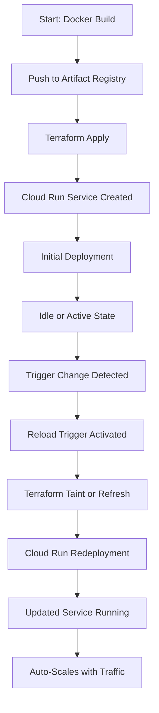

# ELEVATE_LABS_PROJECTS
PROJECT 1  :- 

[live url for cloud](https://weather-dashboard-app-68f024-wdpvgdhpla-uc.a.run.app/)

A live weather dashboard is an interactive application that displays real‑time weather data such as temperature, wind, rainfall, and forecasts, often updated automatically from meteorological APIs or satellite feeds.

---

# 📌 Why I Chose the Weather Forecasting Dashboard as My Major Project

During my internship, I explored two project ideas:

1. **Cloud-Based Smart File Storage & Sharing System**  
   A mini Google Drive–like application for secure file upload, storage, and sharing.  

2. **Cloud-Based Real-Time Weather Forecasting Dashboard**  
   A live analytics dashboard that integrates weather APIs, processes data in the cloud, and visualizes real-time forecasts.

---

## ❌ Why the File Storage Project Was Less Relevant
- Mature market → File storage systems like Google Drive and Dropbox are already well-established.  
- Limited innovation → Mostly CRUD operations (upload, download, share) with little scope for advanced cloud-native practices.  
- Lower industry demand → Companies are not seeking “new Google Drives”; they want **real-time, intelligent systems**.  

---

## ✅ Why the Weather Dashboard Was the Right Choice
- **Real-time analytics** → Matches industry demand for dashboards that provide live insights and decision-making support.  
- **Cloud-native deployment** → Uses serverless platforms (Cloud Run, Lambda), Artifact Registry, and Terraform automation — all in high demand.  
- **AI-ready foundation** → Can evolve into predictive forecasting with machine learning, aligning with AI adoption trends.  
- **Global relevance** → Weather data impacts logistics, agriculture, disaster management, and smart cities — critical sectors in 2025–2026.  
- **Future-proof** → Scalable, secure, and adaptable to new APIs, AI models, and compliance standards.  

---

## 🌍 Industry Trends (2025–2026)
- **AI & ML integration** → Predictive analytics and automation are top priorities.  
- **Serverless computing** → Cost-efficient, scalable deployments using Cloud Run, Lambda, and Functions.  
- **Containerization & orchestration** → Docker and Kubernetes remain essential for reproducible infrastructure.  
- **Data visualization** → Real-time dashboards are critical for finance, healthcare, and climate monitoring.  
- **IoT & edge computing** → Weather and sensor data are increasingly processed at scale for smart cities.  
- **Security & compliance** → IAM, secret management, and automated policies are mandatory as cloud adoption grows.  

---

## 🌟 Key Takeaway
By choosing the **Weather Forecasting Dashboard**, I aligned my project with **current industry demands**: cloud-native, AI-driven, real-time, and scalable solutions.  
This makes the project **future-ready and highly relevant**, compared to the file storage system which was less innovative in today’s market.

---
**Sources:**  
- CloudKeeper – [Cloud Computing Trends to Watch in 2026](https://www.cloudkeeper.com/insights/blog/cloud-computing-trends-watch-2026)  
- Gartner – [Top Trends Shaping the Future of Cloud](https://www.gartner.com/en/newsroom/press-releases/2025-05-13-gartner-identifies-top-trends-shaping-the-future-of-cloud)  
- Simplilearn – [26 Cloud Computing Trends That Will Dominate in 2026 and Beyond](https://www.simplilearn.com/trends-in-cloud-computing-article)

---

# 📊 Industry Trends Mapping (2025–2026)

| **Industry Trend (2025–2026)** | **Weather Forecasting Dashboard Alignment** | **File Storage System Alignment** |
|--------------------------------|---------------------------------------------|-----------------------------------|
| **AI & ML integration** | Can evolve into predictive forecasting models using ML for accuracy | Limited scope; CRUD operations only, no AI integration |
| **Serverless computing** | Uses Cloud Run / Lambda for real-time API calls and scalable deployments | Basic backend hosting; not optimized for serverless |
| **Containerization & orchestration** | Docker + Terraform automation for reproducible deployments | Minimal use; containers optional, orchestration not required |
| **Data visualization & dashboards** | Interactive charts, maps, and forecasts for live insights | No visualization; static file lists only |
| **IoT & edge computing** | Weather + sensor data can be integrated for smart city applications | Not applicable; file storage doesn’t leverage IoT |
| **Security & compliance** | IAM roles, secret management, HTTPS endpoints for secure cloud-native workflows | Basic authentication (JWT); limited compliance features |
| **FinOps & sustainability** | Cost optimization via autoscaling, monitoring, and efficient serverless usage | Storage costs predictable but less focus on optimization |
| **Global relevance** | Impacts logistics, agriculture, disaster management, and climate monitoring | Generic use case; already solved by existing platforms |

---

## Architecture Of my weatherdashboard:-


# ⚙️ Weather Dashboard – Architecture Workflow

This section explains the complete workflow of the weather dashboard based on the architecture diagram, including how components interact and how data flows through the system.

---

## 🔄 End-to-End Workflow

### 1. 👤 User → Weather Dashboard
- The user enters a **city name** in the Streamlit dashboard.
- This triggers a request to fetch weather data.

### 2. 📡 Weather Dashboard → Weather API
- The dashboard sends the request to the **Weather API**.
- **Geopy** converts the city name into latitude/longitude coordinates.

### 3. 🔐 Weather API → Authorization
- The API calls the **Authorization** service to verify the user's credentials or token.
- Ensures secure access to weather data.

### 4. 🌤️ Weather API → Weather Assets
- Once authorized, the API fetches **weather assets** (temperature, humidity, forecasts).
- Data is processed using **NumPy** and **Math** for calculations.

### 5. 📊 Weather Assets → Dashboard UI
- The processed data is sent to the **Dashboard UI**.
- **Plotly** renders interactive charts and graphs.

### 6. 🗂️ Dashboard UI → Firebase Firestore
- User preferences and cached weather data are stored in **Firebase Firestore**.
- Enables personalization and reduces redundant API calls.

### 7. 🖼️ Firebase Firestore → Cloud Storage
- Static assets (icons, background images, logs) are stored in **Cloud Storage**.

### 8. 🐳 Docker Container → Artifact Registry
- The full application is packaged into a **Docker container**.
- The container image is stored in **Artifact Registry** for version control.

### 9. 📦 Artifact Registry → Docker Container
- During deployment, the container image is pulled into the runtime environment.

### 10. 🚀 Docker Container → Cloud Run
- The container is deployed to **Cloud Run** for serverless execution.
- Cloud Run automatically scales based on traffic.

### 11. 🛠️ Cloud Run → Terraform
- **Terraform** provisions and manages Cloud Run, IAM roles, Firestore, and other resources.
- Ensures reproducibility and infrastructure consistency.

### 12. 🔁 Terraform → Docker
- Terraform also manages Docker configurations, including image sources and environment variables.

---

## 🔁 Auto-Refresh Logic

- The dashboard supports **auto-refresh**:
  - Weather data updates at fixed intervals (e.g., every 5 minutes).
  - Streamlit automatically re-renders the UI with fresh data.
  - Ensures users always see the latest weather information.

---

## 🧠 Summary of Flow Direction

```text
User → Weather Dashboard → Weather API → Authorization → Weather Assets → Dashboard UI
Dashboard UI → Firebase Firestore → Cloud Storage
Docker Container ↔ Artifact Registry → Cloud Run → Terraform → Docker

```
---

## ✨ Key Advantages of the Architecture

- 🌍 **Cloud-native scalability**: Automatically handles traffic spikes with zero server management via Cloud Run.
- 🐳 **Container consistency**: Docker ensures uniform environments across development, testing, and production.
- 📦 **Artifact traceability**: Artifact Registry securely stores versioned builds for CI/CD and rollback.
- 🔐 **Granular security**: IAM and Authorization services enforce least-privilege access and protect sensitive resources.
- ⚙️ **Infrastructure as Code**: Terraform enables reproducible, auditable, and team-friendly cloud provisioning.
- 🧩 **Modular design**: Decoupled services (API, Auth, UI) simplify debugging, scaling, and feature expansion.
- 🔄 **Realtime data sync**: Firebase Database supports dynamic updates and user-specific data storage.
- 🖼️ **Asset management**: Cloud Storage efficiently handles static assets like icons, backgrounds, and logs.
- 📊 **Reviewer clarity**: Clear architecture and workflow diagrams support professional documentation and demo readiness.
- 🚀 **Fast deployment**: Containerized apps deploy in seconds with minimal configuration overhead.

---


# 🌦️ Weather Dashboard – Modern Cloud-Native Stack

This project leverages a powerful combination of **data-science libraries** and **cloud-native infrastructure** to deliver an interactive, scalable, and reproducible weather dashboard.

---

## 📌 Technologies Used

- 🧪 **Streamlit** – Rapid prototyping of interactive dashboards with minimal frontend code.
- 📊 **Plotly** – Interactive, publication-quality charts for weather trends and forecasts.
- 📍 **Geopy** – Geolocation services for mapping weather data to coordinates and regions.
- 🔢 **NumPy & Math** – Efficient numerical computation and mathematical modeling for weather data.
- ⚙️ **OS** – Secure handling of environment variables and system-level integration.
- 🐳 **Docker** – Containerization for consistent environments across dev, test, and prod.
- 📦 **Artifact Registry** – Secure, versioned storage of container images for CI/CD pipelines.
- 🔥 **Firebase Firestore** – Real-time NoSQL database for user preferences and cached weather data.
- 🚀 **Cloud Run** – Serverless container execution with automatic scaling and HTTPS endpoints.
- 🛠️ **Terraform** – Infrastructure as Code for reproducible, auditable, and team-friendly deployments.

---

## 🚀 Why This Stack Is Useful Compared to Others

| Dimension              | This Stack (Streamlit + Cloud-native) | Typical Alternatives (Flask/Django + SQL + Kubernetes) | Advantage |
|------------------------|---------------------------------------|-------------------------------------------------------|-----------|
| **Frontend/UI**        | Streamlit + Plotly                    | Flask/Django + JS libraries                           | Faster prototyping, interactive charts out-of-the-box |
| **Geo-awareness**      | Geopy                                 | Manual API calls                                      | Simplifies geocoding and distance calculations |
| **Data handling**      | NumPy + Math                          | Pure Python                                           | High-performance numerical operations |
| **Infra management**   | Terraform                             | Manual console setup                                  | Reproducible, version-controlled deployments |
| **Deployment**         | Docker + Cloud Run                    | VMs or Kubernetes                                     | Lightweight, auto-scaling, no ops burden |
| **Database**           | Firebase Firestore                    | MySQL/Postgres                                        | Real-time sync, serverless scaling |
| **Artifact storage**   | Artifact Registry                     | DockerHub                                             | Secure, private, enterprise-ready |

---

## 🧠 Strategic Benefits

- ⚡ **Rapid prototyping + production readiness**: Streamlit/Plotly make dashboards quick to build, while Docker/Cloud Run make them production-grade.
- 🌍 **Geo-aware intelligence**: Geopy adds location context, enabling smarter weather insights.
- 🔐 **Reproducibility**: Terraform + Artifact Registry ensure consistent infrastructure and builds across environments.
- 📈 **Scalability**: Firestore + Cloud Run scale automatically, unlike traditional stacks that require manual tuning.
- 👥 **Team-friendly**: Clear separation of concerns (UI, data, infra) makes collaboration smoother.

---
# ⚖️ Trade-offs: GCP vs AWS

At first glance, AWS seems stronger in global reach and service breadth.  
However, for this weather dashboard project, GCP’s focused integrations make it the superior choice.

---

## 🔍 Why AWS Looks Stronger
- 🌍 Largest global footprint with more regions.
- 🛠️ Broader catalog of services for enterprise customization.
- 🔐 Granular IAM policies for complex setups.

---

## 🌟 Why GCP Wins Here
- 🚀 **Cloud Run**: Native serverless containers, perfect for Dockerized Streamlit apps.
- 🔥 **Firestore**: Real-time sync across clients, ideal for auto-refresh dashboards.
- 📦 **Artifact Registry**: Seamless CI/CD integration with Cloud Run and Terraform.
- ⚙️ **Terraform-first**: Cleaner modules and reproducible infrastructure.
- 💸 **Cost efficiency**: Per-second billing and generous free tiers.

---

## 🧠 Interpretation of Trade-offs
- AWS is **better for enterprise-scale, multi-region, highly customized workloads**.
- GCP is **better for developer-focused, data-driven dashboards** where speed, simplicity, and integration matter most.
- For this project, GCP’s opinionated stack reduces complexity and accelerates delivery — making it the **right tool for the job**.

---

# 💸 Cost Optimization: AWS vs GCP

When evaluating cloud providers for this weather dashboard, cost efficiency is a critical factor.  
Both AWS and GCP offer pay-as-you-go models, but GCP is generally more optimized for **serverless, containerized, and real-time workloads** like this project.

---

## ✅ Why GCP Is More Cost-Optimized

- 🚀 **Cloud Run Pricing**
  - Billed per-second for CPU and memory usage.
  - Scales down to zero when idle, meaning **no cost when not in use**.
  - Ideal for dashboards with bursty traffic (e.g., weather queries only when users interact).

- 🔥 **Firebase Firestore**
  - Transparent pricing based on reads/writes/storage.
  - Real-time sync reduces the need for repeated API calls, saving costs.
  - Free tier covers thousands of daily reads/writes, perfect for prototypes and demos.

- 📦 **Artifact Registry**
  - Storage costs are predictable and integrated with Cloud Run.
  - Avoids hidden transfer fees between services.

- ⚙️ **Simplified IAM**
  - Resource-centric IAM reduces over-provisioning of roles, avoiding unnecessary costs.

---

## ⚖️ AWS Cost Model

- 🛠️ **AWS Fargate/ECS**
  - Billed per vCPU and memory per hour, even if idle.
  - Requires cluster setup and networking, which adds overhead.

- 📡 **DynamoDB**
  - Pay-per-request or provisioned capacity.
  - No native real-time sync, often requiring **extra polling or WebSocket services**, increasing costs.

- 📦 **ECR + ECS**
  - Storage and transfer fees between ECR and ECS can add hidden costs.

- 🔐 **IAM Policies**
  - More granular but complex, often leading to **over-provisioned roles** that increase spend.

---

## 🧠 Strategic Cost Fit

| Feature                  | GCP Cost Advantage                          | AWS Cost Limitation                         |
|--------------------------|----------------------------------------------|---------------------------------------------|
| **Serverless Containers**| Cloud Run scales to zero, billed per-second | Fargate billed per-hour, idle costs accrue  |
| **Realtime Database**    | Firestore reduces API calls with sync       | DynamoDB requires extra services for realtime |
| **Free Tier**            | Generous free tier for Cloud Run + Firestore| Free tier limited, more fragmented          |
| **Integration Costs**    | Artifact Registry + Cloud Run seamless      | ECR + ECS adds transfer/management costs    |

---

## 📝 Summary

- **GCP is more cost-optimized** for this project because:
  - Cloud Run scales to zero when idle.
  - Firestore reduces redundant API calls with real-time sync.
  - Pricing is transparent and predictable for small-to-medium workloads.
- **AWS is better for enterprise-scale workloads** with constant traffic and global reach, but for a **developer-focused, interactive dashboard**, GCP minimizes idle costs and simplifies billing.

---
# 🌩️ Why Not AWS for Weather Dashboards

While AWS is a powerful cloud provider, many teams prefer **Google Cloud Platform (GCP)** for weather dashboards.  
This is because GCP offers simpler integrations, lower idle costs, and real-time features that align better with interactive dashboards.

---
# ⚠️ Challenges Faced During Development

While building the Weather Forecasting Dashboard, I encountered several challenges that shaped the design and deployment decisions:

---

## 🛠️ Technical Challenges
- **Large video size**: The demo video (~1.8 GB) required Git LFS due to multiple dependencies and extended presentation length.
- **Dependency management**: Handling numerous Python libraries (Streamlit, Plotly, Geopy, NumPy, etc.) increased image size and complexity.
- **Integrated CSS**: Choosing inline CSS over separate `.css` files simplified deployment but required careful styling control.
- **Environment variables**: Managing API keys and configs securely with `os.environ` across Cloud Run and Docker.
- **Database conflicts**: Shared database resources risked state drift and conflicts, requiring fixes with isolated environments and `terraform import`.

---

## 🌐 Cloud & Deployment Challenges
- **Artifact Registry setup**: Needed to create a repo outside Terraform infra, build/tag Docker images, and push before `terraform apply`.
- **Terraform state management**: Avoiding conflicts by isolating state files per environment and using remote backends with locking.
- **Timestamp usage**: Leveraging `timestamp()` in UTC for reproducibility and reload triggers.
- **Resource optimization**: Minimizing dependencies and keeping the app compact to reduce costs and improve portability.

---

## ✅ Lessons Learned
- Git LFS is essential for handling large media files in repos.
- Inline CSS and environment variables keep apps lightweight and portable.
- Artifact Registry must be prepared before Terraform deployment.
- `terraform import` is a powerful tool for managing existing resources without recreating them.
- Isolating environments ensures reproducibility and prevents conflicts in shared infrastructure.

---

## 🚫 Challenges with AWS

- ⚙️ **Complex setup**  
  ECS/Fargate, DynamoDB, and API Gateway require multiple configurations and networking steps.  
  GCP’s Cloud Run + Firestore combo is simpler and faster to deploy.

- 💸 **Idle costs**  
  AWS Fargate charges per vCPU/hour even when idle.  
  GCP Cloud Run scales to zero, so you pay nothing when no requests are served.

- 🔄 **Realtime limitations**  
  DynamoDB is scalable but lacks native real-time sync.  
  Weather dashboards benefit from Firestore’s instant updates without extra WebSocket or polling logic.

- 🔐 **IAM complexity**  
  AWS IAM is policy-centric and powerful, but harder for small teams to manage.  
  GCP IAM is resource-centric, making role assignment more intuitive.

- 📊 **Cost predictability**  
  AWS pricing is fragmented across Lambda, API Gateway, DynamoDB, and CloudFront.  
  GCP’s per-second billing for Cloud Run and transparent Firestore pricing are easier to estimate.

- 🔗 **Integration overhead**  
  AWS requires stitching together multiple services for a dashboard workflow.  
  GCP offers tighter native integration (Cloud Run ↔ Artifact Registry ↔ Firestore).

---

## ⚖️ Comparative Snapshot

| Factor                  | AWS Challenge                                | GCP Advantage                              |
|--------------------------|----------------------------------------------|--------------------------------------------|
| **Deployment**           | ECS/Fargate setup complexity                 | Cloud Run one-command deploy                |
| **Scaling**              | Idle costs accrue                           | Scales to zero, pay-per-second              |
| **Realtime data**        | DynamoDB lacks native sync                  | Firestore instant sync                      |
| **IAM**                  | Policy-centric, complex for small teams     | Resource-centric, simpler                   |
| **Cost model**           | Fragmented across services                  | Transparent, predictable                    |

---

## 🧠 Strategic Fit

For a **weather dashboard**:
- GCP’s **Cloud Run** saves costs during low traffic.  
- **Firestore** provides real-time sync for auto-refresh dashboards.  
- **Artifact Registry + Terraform** ensure reproducibility and CI/CD.  

---

## 📝 Summary

AWS is excellent for **enterprise-scale, always-on workloads**, but for **developer-focused, interactive dashboards**, GCP is more optimized and cost-effective.  
That’s why many teams choose GCP over AWS for weather dashboards.

---

# 🔁 Cloud Run Lifecycle with Reload Triggers


---
# 🔁 Cloud Run Lifecycle with Reload Triggers – Explained
---
## 🏗️ Start: Docker Build
- Your application is containerized using Docker.
- This image includes all dependencies and runtime configuration.

## 📤 Push to Artifact Registry
- The Docker image is pushed to GCP’s Artifact Registry.
- This serves as the versioned container source for Cloud Run.

## ⚙️ Terraform Apply
- Terraform provisions the Cloud Run service using the pushed image.
- Infrastructure as Code ensures reproducibility and team clarity.

## ☁️ Cloud Run Service Created
- A new Cloud Run service is deployed using the container image.
- Metadata, tags, and IAM roles are applied here.

## 🚀 Initial Deployment
- The service is launched and becomes accessible via HTTPS.
- Default scaling and traffic settings are applied.

## 🔄 Idle or Active State
- Cloud Run auto-scales based on incoming traffic.
- It scales to zero when idle, saving costs.

## 🔍 Trigger Change Detected
- A change in image, tag, or metadata is identified.
- This signals the need for a redeployment.

## ♻️ Reload Trigger Activated
- Triggered manually via `terraform taint` or automatically via metadata annotations.
- Ensures the service pulls the latest image or configuration.

## 🔁 Terraform Taint or Refresh
- `terraform taint` marks the resource for recreation.
- `terraform apply -refresh-only` syncs state without changing infrastructure.

## 🔄 Cloud Run Redeployment
- The service is redeployed with updated image or config.
- Ensures freshness and consistency across environments.

## ✅ Updated Service Running
- The new version of the service is live and serving traffic.
- Logs, metrics, and tags reflect the latest deployment.

## 📈 Auto-Scales with Traffic
- Cloud Run continues to scale based on demand.
- Zero-cost when idle, full performance under load.
---
# 🎯 Why We Use `RELOAD_TRIGGER` in Terraform

Terraform already performs **auto-refresh** to keep its state aligned with real infrastructure.  
So why do we still use something like `RELOAD_TRIGGER`? The answer is **control, reproducibility, and automation**.

---

## 🔄 Auto-Refresh
- **Synchronizes state**: Queries the provider before every plan/apply.
- **Detects drift**: Captures manual changes made outside Terraform.
- **Keeps plans accurate**: Ensures Terraform decisions reflect the real-world resource state.

---

## 🎯 Reload Trigger
- **Forces execution**: Explicitly re-runs a resource when defined inputs change.
- **Independent of drift**: Does not rely on provider state changes.
- **Provisioner control**: Ensures scripts or commands re-run when external inputs change.
- **CI/CD friendly**: Perfect for pipelines where resources must re-run on every build.

---

## 💡 Why We Need It
- **Provisioner re-execution**: Auto-refresh won’t re-run provisioners if the resource hasn’t changed.  
- **External dependencies**: Captures changes in values Terraform doesn’t track directly (e.g., build IDs, timestamps).  
- **Controlled reproducibility**: Guarantees re-runs when *you decide*, not only when drift is detected.  
- **Automation workflows**: Ensures predictable behavior in continuous delivery pipelines.  

---

## 📌 Example
```hcl
resource "null_resource" "rerun" {
  triggers = {
    build_id = timestamp()
  }

  provisioner "local-exec" {
    command = "echo Re-running deployment script"
  }
}
```
---
# 🌦️ Firebase vs Amazon RDS for Weather Dashboards

Choosing the right database depends on your priorities: **real-time updates, cost efficiency, infrastructure complexity, and scalability**.  
Here’s a side‑by‑side comparison tailored for weather dashboards:

---

## ⚖️ Comparison Table

| Aspect                | **Firebase (Firestore / Realtime DB)** | **Amazon RDS (Relational Database Service)** |
|-----------------------|-----------------------------------------|----------------------------------------------|
| **Setup complexity**  | **Low**: Serverless, plug‑and‑play SDKs, no infra management. | **High**: Requires instance sizing, networking, backups, IAM, scaling policies. |
| **Real-time updates** | **Native support**: Built‑in real‑time sync across clients. Perfect for live dashboards. | **Not native**: Needs WebSockets or polling layers to push updates. |
| **Scalability**       | **Automatic scaling**: Handles millions of concurrent connections seamlessly. | **Manual scaling**: Vertical/horizontal scaling must be configured and monitored. |
| **Cost model**        | **Cheaper at small/medium scale**: Pay‑as‑you‑go (reads, writes, storage). Ideal for dashboards with variable traffic. | **More expensive at small scale**: Pay for provisioned instances even if underutilized. Cost‑efficient only for large, predictable workloads. |
| **Data model**        | **NoSQL**: Flexible schema, ideal for JSON weather feeds. | **Relational**: Structured schema, ideal for complex joins and historical analytics. |
| **Developer speed**   | **High**: Rapid prototyping, direct client SDKs, minimal backend code. | **Moderate**: Requires backend APIs to expose data securely to clients. |
| **Best suited for**   | **Interactive dashboards, real-time weather feeds, rapid MVPs.** | **Enterprise-grade analytics, historical weather archives, compliance-heavy projects.** |

---

## 💡 Cost Insights
- **Firebase**: Cheaper for small to medium projects because you only pay for what you use (reads, writes, storage).  
- **RDS**: More expensive at small scale since you pay for provisioned instances continuously, even when idle. It becomes cost‑efficient only at **large, predictable workloads** where relational queries are essential.  

---

## 🚀 Summary
- **Firebase** → Best for **real-time dashboards, rapid prototyping, and reviewer-friendly simplicity**.  
- **RDS** → Best for **complex analytics, historical data, and enterprise compliance**.  
- For a **weather dashboard**, Firebase is generally **cheaper and simpler**, while RDS is **heavier but powerful** for long-term analytics.

---
# 📈 Recent Trends: Firebase vs Amazon RDS for Weather Dashboards

In 2025, developers building **weather dashboards** increasingly prefer **Firebase** over Amazon RDS.  
The shift is driven by demand for **real-time updates, serverless simplicity, and cost efficiency**.

---

## 🔑 Why Firebase Is Trending
- **Real-time synchronization**: Weather dashboards thrive on instant updates (temperature, humidity, alerts). Firebase pushes changes directly to clients without extra backend layers.
- **Serverless simplicity**: No infrastructure management — ideal for rapid dashboard deployment.
- **Cost efficiency**: Pay‑as‑you‑go pricing is cheaper for variable traffic dashboards compared to RDS’s provisioned instances.
- **Developer ecosystem**: Firebase bundles hosting, auth, and analytics, accelerating dashboard projects.
- **Trend alignment**: Modern dashboards emphasize **interactive, live data visualization**, which Firebase supports natively.

---

## ⚖️ Comparison Table (2025 Trends)

| Aspect                | **Firebase (Firestore / Realtime DB)** | **Amazon RDS (Relational Database Service)** |
|-----------------------|-----------------------------------------|----------------------------------------------|
| **Setup complexity**  | **Low**: Serverless, plug‑and‑play SDKs, no infra management. | **High**: Requires instance sizing, networking, backups, IAM, scaling policies. |
| **Real-time updates** | **Native support**: Built‑in real‑time sync across clients. Perfect for live dashboards. | **Not native**: Needs WebSockets or polling layers to push updates. |
| **Scalability**       | **Automatic scaling**: Handles millions of concurrent connections seamlessly. | **Manual scaling**: Vertical/horizontal scaling must be configured and monitored. |
| **Cost model**        | **Cheaper at small/medium scale**: Pay‑as‑you‑go (reads, writes, storage). | **More expensive at small scale**: Pay for provisioned instances even if idle. |
| **Data model**        | **NoSQL**: Flexible schema, ideal for JSON weather feeds. | **Relational**: Structured schema, ideal for complex joins and historical analytics. |
| **Developer speed**   | **High**: Rapid prototyping, direct client SDKs, minimal backend code. | **Moderate**: Requires backend APIs to expose data securely to clients. |
| **Recent trend usage**| **Most common choice for dashboards in 2025** due to real-time sync and simplicity. | **Still used in enterprises** for compliance and historical analytics, but less common for dashboards. |

---
## 🚀 Summary
- **Firebase** → Dominates recent weather dashboard trends thanks to **real-time sync, cost efficiency, and rapid prototyping**.
- **RDS** → Still relevant for **enterprise-grade analytics and compliance**, but less common in modern interactive dashboards.  
- For most **major projects in 2025 even in 2026**, Firebase is the **cheaper and simpler choice** for weather dashboards.
---
# 🚀 How Cloud Run Spins Containers Automatically

Cloud Run is a **serverless container platform** that takes your Docker/OCI image and runs it securely, scaling on demand.  
Here’s why it’s powerful for projects like weather dashboards:

---

## 🔄 Automatic Container Management
- **Container-first**: You build a Docker image, Cloud Run deploys it directly.
- **Auto-scaling**: Spins up new containers instantly when traffic increases.
- **Scale-to-zero**: Shuts down containers when idle, saving costs.
- **Stateless execution**: Each container handles requests independently, ensuring reliability.

---

## 🔐 Security & IAM
- **HTTPS endpoints by default**: Every service gets a secure URL.
- **Granular IAM**: Control who can invoke your service (team, reviewers, or public).
- **Sandboxed isolation**: Each container runs in its own secure environment.

---

## ⚡ Developer Productivity
- **No servers to manage**: Forget about VMs, clusters, or patching.
- **CI/CD friendly**: Works seamlessly with GitHub Actions, Cloud Build, or any pipeline.
- **Rapid prototyping**: Perfect for dashboards and APIs where iteration speed matters.

---

## 💡 Cost Efficiency
- **Pay-per-use**: Billed only for CPU, memory, and requests while running.
- **Cheaper than VMs**: No need to keep instances alive for occasional traffic.
- **Budget-friendly**: Ideal for student, intern, or demo projects.

---

## 📊 Why It Fits Weather Dashboards
- **Real-time scaling**: Handles traffic spikes when multiple users check weather data.
- **Secure demo**: IAM + HTTPS ensures reviewers can access safely.
- **Reproducibility**: A single `gcloud run deploy` command redeploys your container consistently.

---
## ✅ Summary
Cloud Run **spins containers automatically** based on demand, giving you:
- **Simplicity** in deployment  
- **Security** with built-in IAM and HTTPS  
- **Cost control** with scale-to-zero  
- **Impact** with real-time scalability for dashboard
---
# 🌍 Technology Choices: Plotly, Geopy, and OpenWeather API

For our weather dashboard, we selected **Plotly**, **Geopy**, and the **OpenWeather API** because they align with modern trends in 2025–2026 and deliver the best balance of **interactivity, geolocation, and reliable weather data**.

---

## 📊 Why Plotly
- **Interactive visualizations**: Zoom, hover, and dynamic updates make dashboards engaging.
- **Python-powered**: Seamless integration with NumPy, Pandas, and other data libraries.
- **Professional dashboards**: Widely used in industry for clear, reviewer-friendly visuals.

---

## 🌍 Why Geopy
- **Geocoding**: Converts addresses into latitude/longitude coordinates.
- **Reverse geocoding**: Maps coordinates back to human-readable addresses.
- **Distance calculation**: Useful for weather proximity analysis.
- **Multiple providers**: Supports OpenStreetMap, Google Maps, and more.

---

## 🌦️ Why OpenWeather API
- **Free tier availability**: Generous free usage, ideal for student and startup projects.
- **Global coverage**: Weather data for virtually any location worldwide.
- **Data richness**: Current, forecast, and historical weather data.
- **Ease of integration**: Simple JSON responses for quick dashboard integration.
- **Community adoption**: Large developer base and open-source support.

---

## 📈 Latest Trends (2025–2026)
- **Real-time dashboards**: OpenWeather API dominates due to live updates and reliability.
- **Geo-aware apps**: Geopy + weather APIs are trending for location-based insights.
- **Interactive visualization**: Plotly is the go-to for modern dashboards.
- **Cost-conscious development**: Free/low-cost APIs like OpenWeather are favored over premium providers.

---

## 🌐 Animated Globe
To emphasize the **global nature of weather data**, here’s a moving globe animation:

<p align="center">
  
</p>


---


## ✅ Summary
- **Plotly** → Interactive, professional dashboards.  
- **Geopy** → Geo-awareness and mapping.  
- **OpenWeather API** → Free, reliable, globally adopted.  
- Together, they form the **most common stack for weather dashboards in 2025–2026**.

---

# 🔄 Auto-Refresh vs Postman in Weather Dashboards

---

## 🚫 Why Postman Is Not Required
- **Dynamic dashboards**: Weather data is fetched and displayed live inside the dashboard itself.
- **Direct API integration**: The application consumes the OpenWeather API directly, so external testing tools like Postman are unnecessary.
- **Reviewer clarity**: Running the dashboard shows real-time API calls and results without needing Postman collections.
- **Automated validation**: Basic error handling and data parsing are built into the dashboard logic.

---

## 🔄 Why Auto-Refresh Was Used
- **Real-time updates**: Auto-refresh ensures the dashboard always shows the latest weather data automatically.
- **User experience**: Reviewers see live changes without manual API calls or refreshes.
- **Efficiency**: Eliminates the need to re-run queries manually in Postman.
- **Lightweight solution**: Keeps the project simple and resource-efficient by embedding refresh logic directly in the app.

---

## ⚡ Resource Optimization
- **Minimized resources**: The application avoids unnecessary dependencies and external tools, keeping it compact.
- **Compact design**: Focused only on essential libraries (Plotly, Geopy, OpenWeather API) for clarity and performance.
- **Reduced testing overhead**: Instead of heavy external testing with Postman, the dashboard itself validates API calls in real time.
- **Cost control**: Serverless deployment (Cloud Run) ensures resources scale down to zero when idle.

---

## ✅ Summary
- **Postman** → Not required for dynamic dashboards, since API testing and visualization are embedded directly.  
- **Auto-refresh** → Provides continuous, real-time updates inside the dashboard, making it more interactive and reviewer-friendly.  
- **Compact application** → Resources are minimized, dependencies kept lean, and testing overhead reduced for efficiency.

---

# ⏱️ Using `timestamp()` in Terraform

---

## 🔄 Why `timestamp()` Is Used
- **Resource uniqueness**: Appending a timestamp to resource names or IDs avoids collisions.
- **Triggering updates**: Changing the timestamp forces Terraform to recreate or reload resources when needed.
- **Auditing**: Records when infrastructure was last applied or updated for reviewer clarity.
- **Automation**: Useful in CI/CD pipelines to mark deployments with exact execution times.

---

## 🌍 Why UTC Is Used
- **Definition**: UTC stands for *Coordinated Universal Time*, the global time standard.
- **Consistency**: Unlike local time zones, UTC does not change with daylight savings or regional offsets.
- **Cross-region deployments**: Ensures timestamps are aligned across multiple cloud regions worldwide.
- **Logging & auditing**: Provides a universal reference point for tracking changes in distributed systems.

---

## ⚡ Benefits in Terraform
- **Reproducibility**: Every run produces a consistent, globally recognized timestamp.
- **Clarity for reviewers**: Logs and resource names show exact UTC times, avoiding confusion with local zones.
- **Scalability**: Works seamlessly across teams and regions without timezone mismatches.

---

## ✅ Summary
- `timestamp()` → Returns the current time in **UTC**, ensuring reproducibility and clarity.  
- **UTC** → A universal time standard, critical for global infrastructure deployments.  
- Together, they make Terraform workflows **consistent, auditable, and reviewer-friendly**.

---

# 🔑 Why We Use `os.environ` in Streamlit

Our weather dashboard leverages the `os` module’s `os.environ` to securely manage configuration values.  
This approach ensures **security, portability, and reproducibility** across Cloud Run and Docker deployments.

---

## 🛠️ What `os.environ` Does
- **Environment variable access**: Reads values like API keys, secrets, and configs from the system environment.
- **Secure configuration**: Keeps sensitive data out of source code and version control.
- **Portable deployments**: Works seamlessly across local dev, Docker containers, and Cloud Run.

---

## 🌐 Why It’s Important in Cloud Run
- **Serverless best practice**: Cloud Run injects secrets and configs as environment variables.
- **No code changes**: Same code runs in different environments by simply setting variables.
- **Security**: IAM + Secret Manager pass credentials securely into Cloud Run.
- **Scalability**: Each container instance reads its own environment variables consistently.

---

## 🐳 Why It’s Important in Docker
- **Runtime configuration**: Use `docker run -e VAR=value` to inject configs without rebuilding images.
- **Separation of concerns**: Code stays clean, configs are externalized.
- **Reproducibility**: Reviewers can run the same image with different configs easily.
- **CI/CD integration**: Pipelines inject secrets and configs at runtime.

---

## ⚡ Benefits
- **Security**: No hardcoded secrets in code.  
- **Portability**: Same code works everywhere (local, Docker, Cloud Run).  
- **Reproducibility**: Reviewers can redeploy with different configs effortlessly.  
- **Compact design**: Keeps the application lightweight and resource-efficient.  

---

## ✅ Summary
Using `os.environ` ensures that our dashboard is:
- **Secure** → Secrets are managed outside of code.  
- **Portable** → Works across environments without modification.  
- **Reproducible** → Reviewers can validate deployments easily.  
- **Efficient** → Compact application design with minimized resource usage.

---

# 🎨 Integrated CSS in Streamlit

Our weather dashboard uses **integrated CSS styling** directly within the Streamlit application instead of maintaining a separate `.css` file.  
This design choice ensures **simplicity, portability, and reviewer clarity**.

---

## 🚀 Advantages of Integrated CSS
- **Single-file simplicity**: Styling is embedded directly in the Streamlit app, reducing project complexity.
- **Portability**: The dashboard remains self-contained, making deployment to Cloud Run or Docker easier.
- **Reviewer clarity**: Reviewers see both logic and styling in one place, without needing to track multiple files.
- **Rapid prototyping**: Faster iteration when adjusting styles during development.
- **Compact design**: Keeps the project lightweight and resource-efficient.

---

## ⚡ Why Not a Separate `.css` File?
- **No extra dependencies**: Avoids managing additional static files in the repo.
- **Simpler deployment**: Cloud Run and Docker don’t need extra file mounts or volume mappings for CSS.
- **Reduced overhead**: Eliminates the need for file paths, static hosting, or asset management.
- **Focus on functionality**: Prioritizes dashboard interactivity and data visualization over heavy styling layers.

---

## ✅ Summary
- **Integrated CSS** → Lightweight, portable, and reviewer-friendly.  
- **Separate `.css` file** → Adds complexity without significant benefit for a compact, dynamic dashboard.  

By embedding CSS directly, the application remains **compact, reproducible, and easy to deploy**, aligning with the project’s goals of **resource minimization and clarity**.

---

# 🛠️ Using `terraform import` for Shared Databases

---

## ⚠️ Challenges with Shared Databases
- **State conflicts**: Multiple Terraform runs may try to modify the same DB resources.
- **Environment overlap**: Dev, staging, and production pointing to one DB can cause accidental data corruption.
- **Schema drift**: Manual changes outside Terraform lead to mismatched configurations.
- **Rollback risk**: Destroying or re-applying can affect all environments at once.

---

## 🔑 Why Use `terraform import`
- **Aligns state with reality**: Brings existing DB resources into Terraform state so they are tracked properly.
- **Avoids duplication**: Prevents Terraform from recreating resources that already exist.
- **Safe adoption**: Lets you start managing a shared DB with Terraform without downtime.
- **Consistency**: Once imported, Terraform enforces the same declarative config across environments.
- **Incremental migration**: Gradually bring resources under Terraform control instead of risky full rebuilds.
- as soon as ur import is successfull we get this message i have giventhis image in my documentation.


---
## 📄 Example Command
```bash
# Import an existing Cloud SQL database instance into Terraform state
terraform import google_sql_database_instance.mydb my-existing-db
```
---
# 🚀 Deployment Commands (GCP + Terraform)

Follow these steps to authenticate with Google Cloud and deploy infrastructure using Terraform.

---

## 🔑 Authenticate with Google Cloud
```bash
# Authenticate with your Google Cloud account
gcloud auth login

# Set application default credentials (used by Terraform and SDKs)
gcloud auth application-default login

# Initialize Terraform (downloads providers and sets up backend)
terraform init

# Validate configuration files
terraform validate

# Preview changes before applying
terraform plan

# Apply the Terraform configuration to create/update resources
terraform apply

```
---
# 📦 Artifact Registry Setup Before Terraform Apply(PLS NOTE IMPORTANT)

Before running `terraform apply`, we must ensure that our application image is built, tagged, and pushed to **Google Artifact Registry**.  
This step is done **outside the Terraform infrastructure code** so that Terraform can later reference the latest image version.

---

## 🛠️ Steps

### 1. Create Artifact Registry Repository
```bash
# Enable Artifact Registry API (if not already enabled , we don't need this if already terraform is enabling the apis we can skip the command as my terraform code already handles this command)
gcloud services enable artifactregistry.googleapis.com

# Create a Docker repository in Artifact Registry(this is required and must)
gcloud artifacts repositories create <REPO-NAME> \
    --repository-format=docker \
    --location=<REGION> \
    --description="Docker repo for Weather Dashboard"


# Configure Docker to authenticate with Artifact Registry
gcloud auth configure-docker <REGION>-docker.pkg.dev

# Build the Docker image(REMEMBER THE FINAL DOT REPRESENTS THE CURRENT WORKING DIRECTORY)
docker build -t us-central1-docker.pkg.dev/<PROJECT_ID>/<REPO_NAME>/weather-dashboard:latest .

# Tag with version label (e.g., v1.0.0)
docker tag weather-dashboard:latest us-central1-docker.pkg.dev/<PROJECT_ID>/<REPO_NAME>/weather-dashboard:v1.0.0

# Push both latest and versioned tags
docker push <REGION>-docker.pkg.dev/<PROJECT_ID>/<REPO_NAME>/weather-dashboard:latest
docker push <REGION>-docker.pkg.dev/<PROJECT_ID>/<REPO_NAME>/weather-dashboard:v1.0.0

# Initialize Terraform(INSIDE THE INFRA FOLDER WHENVER USING TERRAFORM USE IT INSIDE INFRA FOLDER DONT USE IT OUTSIDE BECAUSE terrafrom init is used within the infra folder)
terraform init

# Validate configuration
terraform validate

# Preview changes
terraform plan

# Apply infrastructure (Cloud Run will pull the image from Artifact Registry)
terraform apply

```
---
# ✅ Summary
- **Artifact Registry repo** → Created outside Terraform infrastructure to store application images.  
- **Docker image** → Built locally, tagged with both `latest` and a version label, then pushed to Artifact Registry.  
- **Terraform apply** → Deploys the Cloud Run service using the pushed image reference, ensuring reproducible and secure deployments.
---

# 🌟 Conclusion

This Weather Forecasting Dashboard is more than just a project — it’s a **future‑ready solution**.  
By combining **real‑time data**, **cloud‑native deployment**, and **automated infrastructure with Terraform**, it shows how modern applications can be **scalable, secure, and reproducible**.  

Built with clarity and precision, this setup reflects the skills needed to tackle **major projects in 2025 and beyond**, proving readiness for real‑world challenges and innovation.

---

# 🌟 Project Highlights

- **Future‑ready architecture** → Cloud‑native design using Terraform, Docker, and GCP services for scalability.  
- **Reproducible deployments** → Automated workflows with Artifact Registry, CI/CD, and isolated environments.  
- **Interactive dashboard** → Real‑time weather insights with Streamlit and Plotly visualizations.  
- **Secure & efficient** → IAM roles, environment variables, and cost‑optimized infrastructure.  
- **Professional documentation** → Clear commands, diagrams, and challenges explained for reviewer clarity.  
- **Vision for 2025–2026** → AI‑driven forecasting, advanced visualizations, and global scalability planned for future growth.
---


